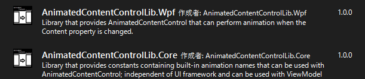
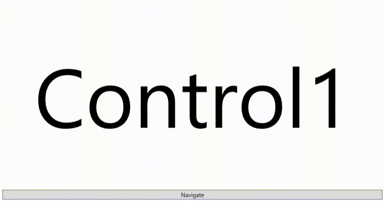
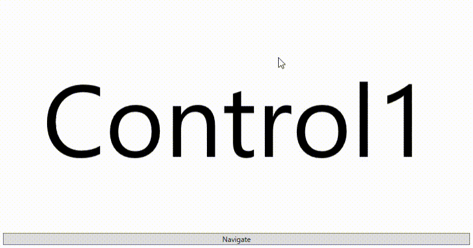
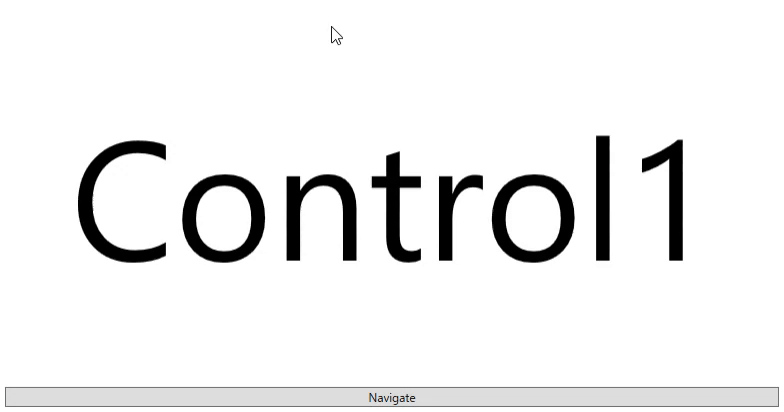

# 

## 概要

本ライブラリはContentプロパティ変更時に自作したアニメーションや
組み込まれた標準のアニメーションを実行可能な
WPFで使用可能なAnimatedContentControlコントロールを提供するライブラリである。

本ライブラリは二つのアセンブリから構成されている。
| アセンブリ名                   | 備考                                                         |
| ------------------------------ | ------------------------------------------------------------ |
| AnimatedContentControlLib.Core | WPFに依存しないViewModelで使用可能な組み込みアニメーション名の定数を提供するアセンブリ |
| AnimatedContentControlLib.Wpf  | AnimatedContentControl本体を提供するアセンブリ               |

## インストール方法

VisualStudioのソリューションエクスプローラー内の[依存関係]を右クリックして
[Nugetパッケージの管理]を選択して[参照]タブの検索欄にAnimatedContentControlLib
と入力後下記写真と同じパッケージをインストールすればよい。



コマンドを用いてインストールしたい際は下記URLに必要なコマンドが記されている。

[NuGet Gallery | AnimatedContentControlLib.Wpf 1.0.0](https://www.nuget.org/packages/AnimatedContentControlLib.Wpf/)
[NuGet Gallery | AnimatedContentControlLib.Core 1.0.0](https://www.nuget.org/packages/AnimatedContentControlLib.Core/)

### どちらのアセンブリをインストールすれば良いのか?

ViewとViewModelを同一のプロジェクトで管理する場合AnimatedContentControlLib.Wpfのみの
インストールでよい。
AnimatedContentControlLib.WpfはAnimatedContentControlLib.Coreに依存しているので
AnimatedContentControlLib.WpfのインストールのみでAnimatedContentControlLib.Coreも付いてくる。

しかし、ViewとViewModelが別プロジェクトの場合
View側のプロジェクトにAnimatedContentControlLib.Wpfをインストールし、
ViewModel側のプロジェクトにAnimatedContentControlLib.Coreをインストールすれば良い。

## 定義済みの組み込みアニメーションを使用する際のサンプル

MainWindow.xaml

``` xaml
<Window x:Class="WpfApp1.MainWindow"
        xmlns="http://schemas.microsoft.com/winfx/2006/xaml/presentation"
        xmlns:x="http://schemas.microsoft.com/winfx/2006/xaml"
        xmlns:d="http://schemas.microsoft.com/expression/blend/2008"
        xmlns:mc="http://schemas.openxmlformats.org/markup-compatibility/2006"
        xmlns:acl="http://AnimatedContentControlLib/Wpf/"
        xmlns:local="clr-namespace:WpfApp1"
        mc:Ignorable="d"
        Title="MainWindow" Height="450" Width="800">

    <Grid>
        <Grid.RowDefinitions>
            <RowDefinition />
            <RowDefinition Height="Auto" />
        </Grid.RowDefinitions>

        <acl:AnimatedContentControl Name="MainContent" 
                                    CurrentStoryboardKey="ModernSlideinRight" />

        <Button Content="Navigate" 
                IsEnabled="{Binding ElementName=MainContent, Path=IsAnimationCompleted}" 
                Click="Button_Click" 
                Grid.Row="1" Margin="5" />
    </Grid>
</Window>
```

MainWindow.xaml.cs

```c#
using System;
using System.Windows;

namespace WpfApp1;

public partial class MainWindow : Window
{
    Type _currentContent = typeof(Control1);

    public MainWindow()
    {
        InitializeComponent();
        this.Loaded += (s, e) =>
        {
            this.MainContent.Content = Activator.CreateInstance(this._currentContent);
        };
    }

    private void Button_Click(object sender, RoutedEventArgs e)
    {
        this._currentContent = 
            this._currentContent == typeof(Control1) ? typeof(Control2) : typeof(Control1);
        this.MainContent.Content = Activator.CreateInstance(this._currentContent);
    }
}
```





AnimatedContentControlクラスのCurrentStoryboardKeyプロパティに
使用したい組み込みアニメーション名を指定して
Contentプロパティを変更するとアニメーションを実行できる。
使用可能なアニメーションの一覧は下記に記す通りである。
また、CurrentStoryboardKeyプロパティはViewModelのプロパティと
バインドして使用する事を想定しているので
各アニメーション名に対応するStatic定数を保持するEmbededAnimationsクラスを
AnimatedContentControlLib.Coreアセンブリに用意している。

| gif                                     | アニメーション名   | AnimatedContentControlLib.Core内で定義されているStatic定数   |
| --------------------------------------- | ------------------ | ------------------------------------------------------------ |
|  | SlideinRight       | AnimatedContentControlLib.Core.Constants.EmbededAnimations.SlideinRight |
|  | SlideinLeft        | AnimatedContentControlLib.Core.Constants.EmbededAnimations.SlideinLeft |
|  | SlideinUp          | AnimatedContentControlLib.Core.Constants.EmbededAnimations.SlideinUp |
|  | SlideinDown        | AnimatedContentControlLib.Core.Constants.EmbededAnimations.SlideinDown |
|  | ModernSlideinRight | AnimatedContentControlLib.Core.Constants.EmbededAnimations.ModernSlideinRight |
|  | ModernSlideinLeft  | AnimatedContentControlLib.Core.Constants.EmbededAnimations.ModernSlideinLeft |
|  | ModernSlideinUp    | AnimatedContentControlLib.Core.Constants.EmbededAnimations.ModernSlideinUp |
|  | ModernSlideinDown  | AnimatedContentControlLib.Core.Constants.EmbededAnimations.ModernSlideinDown |


尚上記サンプルは簡略化のためコードビハインドを使用しているが
PrismのRegionNavigationとの併用も可能である。
その場合下記のようにRegionManager.RegionName添付プロパティを追加すれば
普通のContentControlを使用した画面遷移と同じように実行が可能である。

```xaml
<acl:AnimatedContentControl Name="ContentRegion" 
                            prism:RegionManager.RegionName="ContentRegion" 
                            CurrentStoryboardKey="SlideinRight" />
```

## 自作アニメーションを使用する際のサンプル

MainWindow.xaml

```xaml
<Window x:Class="WpfApp1.MainWindow"
        xmlns="http://schemas.microsoft.com/winfx/2006/xaml/presentation"
        xmlns:x="http://schemas.microsoft.com/winfx/2006/xaml"
        xmlns:d="http://schemas.microsoft.com/expression/blend/2008"
        xmlns:mc="http://schemas.openxmlformats.org/markup-compatibility/2006"
        xmlns:acl="http://AnimatedContentControlLib/Wpf/"
        xmlns:local="clr-namespace:WpfApp1"
        mc:Ignorable="d"
        Title="MainWindow" Height="450" Width="800">

    <Grid>
        <Grid.RowDefinitions>
            <RowDefinition />
            <RowDefinition Height="Auto" />
        </Grid.RowDefinitions>

        <acl:AnimatedContentControl Name="MainContent" 
                                    CurrentStoryboardKey="MyAnimation">

            <acl:AnimatedContentControl.Storyboards>
            	<Storyboard acl:AnimatedContentControl.Key="MyAnimation">
                    <DoubleAnimationUsingKeyFrames BeginTime="0:0:0"
                                                   Storyboard.TargetName="PrimaryContent"
                                                   Storyboard.TargetProperty="(UIElement.Opacity)"
                                                   FillBehavior="Stop">

                        <DiscreteDoubleKeyFrame KeyTime="0:0:0" Value="0" />
                        <LinearDoubleKeyFrame KeyTime="0:0:1" Value="1" />
                    </DoubleAnimationUsingKeyFrames>

                    <DoubleAnimationUsingKeyFrames BeginTime="0:0:0"
                                                   Storyboard.TargetName="SecondaryImage"
                                                   Storyboard.TargetProperty="(UIElement.Opacity)"
                                                   FillBehavior="Stop">

                        <DiscreteDoubleKeyFrame KeyTime="0:0:0" Value="1" />
                        <LinearDoubleKeyFrame KeyTime="0:0:1" Value="0" />
                    </DoubleAnimationUsingKeyFrames>

                    <DoubleAnimationUsingKeyFrames BeginTime="0:0:0"
                                                   Storyboard.TargetName="PrimaryContent"
                                                   Storyboard.TargetProperty="(UIElement.RenderTransform).(TransformGroup.Children)[1].(RotateTransform.Angle)"
                                                   FillBehavior="Stop">

                        <DiscreteDoubleKeyFrame KeyTime="0:0:0" Value="0" />
                        <LinearDoubleKeyFrame KeyTime="0:0:1" Value="360" />
                    </DoubleAnimationUsingKeyFrames>

                    <DoubleAnimationUsingKeyFrames BeginTime="0:0:0"
                                                   Storyboard.TargetName="PrimaryContent"
                                                   Storyboard.TargetProperty="(UIElement.RenderTransform).(TransformGroup.Children)[1].(RotateTransform.Angle)"
                                                   FillBehavior="Stop">

                        <DiscreteDoubleKeyFrame KeyTime="0:0:0" Value="-45" />
                        <EasingDoubleKeyFrame KeyTime="0:0:1" Value="0">
                            <EasingDoubleKeyFrame.EasingFunction>
                                <BounceEase Bounciness="5" />
                            </EasingDoubleKeyFrame.EasingFunction>
                        </EasingDoubleKeyFrame>
                    </DoubleAnimationUsingKeyFrames>

                    <DoubleAnimationUsingKeyFrames BeginTime="0:0:0"
                                                   Storyboard.TargetName="SecondaryImage"
                                                   Storyboard.TargetProperty="(UIElement.RenderTransform).(TransformGroup.Children)[1].(RotateTransform.Angle)"
                                                   FillBehavior="Stop">

                        <DiscreteDoubleKeyFrame KeyTime="0:0:0" Value="0" />
                        <EasingDoubleKeyFrame KeyTime="0:0:1" Value="45">
                            <EasingDoubleKeyFrame.EasingFunction>
                                <BounceEase Bounciness="5" />
                            </EasingDoubleKeyFrame.EasingFunction>
                        </EasingDoubleKeyFrame>
                    </DoubleAnimationUsingKeyFrames>
                </Storyboard>
            </acl:AnimatedContentControl.Storyboards>
        </acl:AnimatedContentControl>

        <Button Content="Navigate" 
                IsEnabled="{Binding ElementName=MainContent, Path=IsAnimationCompleted}" 
                Click="Button_Click" 
                Grid.Row="1" Margin="5" />
    </Grid>
</Window>
```

MainWindow.xaml.cs

```
using System;
using System.Windows;

namespace WpfApp1;

public partial class MainWindow : Window
{
    Type _currentContent = typeof(Control1);

    public MainWindow()
    {
        InitializeComponent();
        this.Loaded += (s, e) =>
        {
            this.MainContent.Content = Activator.CreateInstance(this._currentContent);
        };
    }

    private void Button_Click(object sender, RoutedEventArgs e)
    {
        this._currentContent = 
            this._currentContent == typeof(Control1) ? typeof(Control2) : typeof(Control1);
        this.MainContent.Content = Activator.CreateInstance(this._currentContent);
    }
}
```


