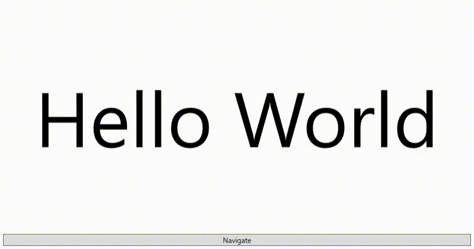

# 

 

[Nuget](https://www.nuget.org/packages/AnimatedContentControlLib.Wpf/)

## 概要

本ライブラリはPrismのRegionで使用する事を想定して作成された
Contentプロパティ変更時に自作したアニメーションや 
組み込まれた標準のアニメーションを実行可能な WPFで
使用可能なAnimatedContentControlコントロールを提供するライブラリである。

本ライブラリは二つのアセンブリから構成されている

|                            Nuget                             |              assembly names               |                           remarks                            |
| :----------------------------------------------------------: | :---------------------------------------: | :----------------------------------------------------------: |
|  | AnimatedContentControlLib.BuiltInAnimKeys | WPFに依存しないViewModelで使用可能な組み込みアニメーション名の定数を提供するアセンブリ |
|  |       AnimatedContentControlLib.Wpf       |        AnimatedContentControl本体を提供するアセンブリ        |

### どちらのアセンブリをインストールすれば良いのか?

ViewとViewModelを同一のプロジェクトで管理する場合AnimatedContentControlLib.Wpfのみの インストールでよい。 AnimatedContentControlLib.WpfはAnimatedContentControlLib.BuiltInAnimKeysに依存しているので AnimatedContentControlLib.WpfのインストールのみでAnimatedContentControlLib.BuiltInAnimKeysも付いてくる。

しかし、ViewとViewModelが別プロジェクトの場合 View側のプロジェクトにAnimatedContentControlLib.Wpfをインストールし、 ViewModel側のプロジェクトにAnimatedContentControlLib.BuiltInAnimKeysをインストールすれば良い。

## 定義済みの組み込みアニメーションを使用する

下記サンプルコードのようにAnimatedContentControl要素のNextBuiltInAnimKey
プロパティに実行したいアニメーションをセットし、
Contentプロパティを変更するとアニメーションが実行される。
本サンプルコードでは簡略化のためコードビハインドから操作しているが
実際はPrismのRegionを用いて画面遷移を行うことを想定している。

### MainWindow.xaml

```MainWindow.xaml
<Window ~省略~
        xmlns:acl="http://AnimatedContentControlLib/Wpf/"
        xmlns:aclKeys="clr-namespace:AnimatedContentControlLib.BuiltInAnimKeys;assembly=AnimatedContentControlLib.BuiltInAnimKeys"
        Loaded="Window_Loaded">

    <DockPanel LastChildFill="True">
    	<Button Content="Navigate" 
    		Click="NavigateButton_Click" 
    		DockPanel.Dock="Bottom" 
    		Margin="5" /> 
            
        <acl:AnimatedContentControl 
        	Name="MainContent" 
        	NextBuiltInAnimKey="{x:Static aclKeys:AnimKeys.ModernSlideinToLeft}" 
        	DockPanel.Dock="Top" 
        	Margin="5" />
    </DockPanel>
</Window>

```


### MainWindow.xaml.cs

```c#
namespace AnimatedContentControlLib.Demo;

using System.Windows;
using System.Windows.Controls;
using AnimatedContentControlLib.BuiltInAnimKeys;

public partial class MainWindow : Window
{
    private readonly Control1 _control1 = new();
    private readonly Control2 _control2 = new();
    private bool _count = false;

    public MainWindow()
    {
        InitializeComponent();
    }

    private void NavigateButton_Click(object sender, RoutedEventArgs e)
    {
        this._count = !this._count;
        object nextControl = this._count ? this._control2 : this._control1;
        this.MainContent.Content = nextControl;
    }

    private void Window_Loaded(object sender, RoutedEventArgs e)
    {
        this.MainContent.Content = this._control1;
    }
}

```


### 結果



## 自作アニメーションを使用する

下記のようにTransformContentControlクラスに対するstoryboardアニメーションを作成して
そのKeyをNextAnimKeyプロパティに指定すると自作アニメーションを実行できる。
NextBuiltInAnimKeyプロパティとNextAnimKeyプロパティを同時に指定するとNextAnimKeyが優先的に
実行されるので自作アニメーションを実行しない場合NextAnimKeyプロパティは指定しないかNullを指定
することが望ましい。

### MainWindow.xaml

```MainWindow.xaml
<Window ~省略~
        xmlns:acl="http://AnimatedContentControlLib/Wpf/"
        xmlns:aclKeys="clr-namespace:AnimatedContentControlLib.BuiltInAnimKeys;assembly=AnimatedContentControlLib.BuiltInAnimKeys"
        Loaded="Window_Loaded">

    <Window.Resources>
        <Storyboard x:Key="SlideinToLeft">
            <DoubleAnimationUsingKeyFrames BeginTime="0:0:0"
                                       Storyboard.TargetName="ContentTransform"
                                       Storyboard.TargetProperty="(acl:TransformContentControl.TranslateXPosRatio)"
                                       FillBehavior="Stop">

                <DiscreteDoubleKeyFrame KeyTime="0:0:0" Value="1" />
                <EasingDoubleKeyFrame KeyTime="0:0:0.4" Value="0">
                    <EasingDoubleKeyFrame.EasingFunction>
                        <SineEase EasingMode="EaseOut" />
                    </EasingDoubleKeyFrame.EasingFunction>
                </EasingDoubleKeyFrame>
            </DoubleAnimationUsingKeyFrames>

            <DoubleAnimationUsingKeyFrames BeginTime="0:0:0"
                                       Storyboard.TargetName="ImageTransform"
                                       Storyboard.TargetProperty="(acl:TransformContentControl.TranslateXPosRatio)"
                                       FillBehavior="Stop">

                <DiscreteDoubleKeyFrame KeyTime="0:0:0" Value="0" />
                <EasingDoubleKeyFrame KeyTime="0:0:0.4" Value="-1">
                    <EasingDoubleKeyFrame.EasingFunction>
                        <SineEase EasingMode="EaseOut" />
                    </EasingDoubleKeyFrame.EasingFunction>
                </EasingDoubleKeyFrame>
            </DoubleAnimationUsingKeyFrames>
        </Storyboard>
    </Window.Resources>

    <DockPanel LastChildFill="True">
    	<Button Content="Navigate" 
    		Click="NavigateButton_Click" 
    		DockPanel.Dock="Bottom" 
    		Margin="5" /> 
            
        <acl:AnimatedContentControl 
        	Name="MainContent" 
        	NextAnimKey="SlideinToLeft"
        	DockPanel.Dock="Top" 
        	Margin="5" />
    </DockPanel>
</Window>

```

### MainWindow.xaml.cs

```c#
namespace AnimatedContentControlLib.Demo;

using System.Windows;
using System.Windows.Controls;
using AnimatedContentControlLib.BuiltInAnimKeys;

public partial class MainWindow : Window
{
    private readonly Control1 _control1 = new();
    private readonly Control2 _control2 = new();
    private bool _count = false;

    public MainWindow()
    {
        InitializeComponent();
    }

    private void NavigateButton_Click(object sender, RoutedEventArgs e)
    {
        this._count = !this._count;
        object nextControl = this._count ? this._control2 : this._control1;
        this.MainContent.Content = nextControl;
    }

    private void Window_Loaded(object sender, RoutedEventArgs e)
    {
        this.MainContent.Content = this._control1;
    }
}

```

### 結果


## 組み込みアニメーションの種類

下記にNextBuiltInAnimKeyプロパティ指定できるアニメーションの種類を列挙する。

| アニメーション名(AnimKeys列挙体のメンバ) | 備考                                                         |
| ---------------------------------------- | ------------------------------------------------------------ |
| null                                     | アニメーションは行われず単に画面が遷移するだけ               |
| SlideinToRight                           | 右方向へのスライドイン                                       |
| SlideinToLeft                            | 左方向へのスライドイン                                       |
| SlideinToUp                              | 上方向へのスライドイン                                       |
| SlideinToDown                            | 下方向へのスライドイン                                       |
| ModernSlideinToRight                     | モダンな右方向へのスライドイン                               |
| ModernSlideinToLeft                      | モダンな左方向へのスライドイン                               |
| ModernSlideinToUp                        | モダンな上方向へのスライドイン                               |
| ModernSlideinToDown                      | モダンな下方向へのスライドイン                               |
| OpacityInOrder                           | 古い画面が消えて新しい画面が現れる                           |
| OpacityNewContent                        | 古い画面のみが消えて後ろにある新しい画面が見えるようになる   |
| OpacitySameTime                          | 古い画面が消えながら新しい画面が現れる                       |
| MechanicalRight                          | 機械的に画面右側が回転して画面遷移する                       |
| MechanicalLeft                           | 機械的に画面左側が回転して画面遷移する                       |
| RotateBigToSmoleToBig                    | 古い画面が回転しながら奥へ飛ばされ新しい画面が回転しながら前面へやってくる |

### ライブラリに含まれるクラスの備考

| 名前空間                               | クラス名                | 備考                                                         |
| -------------------------------------- | ----------------------- | ------------------------------------------------------------ |
| AnimatedContentControlLib.Wpf.Controls | AnimatedContentControl  | Contentプロパティ変更時にアニメーションを実行するためのContentControl |
| AnimatedContentControlLib.Wpf.Controls | TransformContentControl | 0~1までの値で位置変更,回転,サイズ変更を可能にするためのContentControl。本ライブラリのユーザーがAnimatedContentControlクラスの画面遷移時実行される Storyboardを自作できるようにするためにアクセス修飾子をpublicにしてあるが 本ライブラリのユーザーが本クラスを直接利用することは想定していない。 |

### AnimatedContentControlのプロパティ

| プロパティ名       | 型                                                 | 備考                                                         | 規定値 |
| ------------------ | -------------------------------------------------- | ------------------------------------------------------------ | ------ |
| DpiX               | double                                             | テンプレート内のSubImageで使用するX方向のDpiプロパティ       | 96     |
| DpiY               | double                                             | テンプレート内のSubImageで使用するY方向のDpiプロパティ       | 96     |
| IsAnimCompleted    | bool                                               | IsAnimCompletedPropertyに対応するCLRプロパティ               | true   |
| NextAnimKey        | string                                             | リソースに登録されたStoryboardから次のContentプロパティ変更時に実行するStoryboardのKeyを指定するための依存関係プロパティ | null   |
| NextBuiltInAnimKey | AnimatedContentControlLib.BuiltInAnimKeys.AnimKeys | 画面遷移時に組み込みアニメーションを使用する際に利用する組み込みアニメーションを指定するための依存関係プロパティ。nullをセットするとアニメーションは行われない | null   |

### TransformContentControlのプロパティ

| プロパティ名          | 型     | 備考                                                      | 規定値 |
| --------------------- | ------ | --------------------------------------------------------- | ------ |
| TranslateXPosRatio    | double | X方向への位置移動用の依存関係プロパティ                   | 0      |
| TranslateYPosRatio    | double | Y方向への位置移動用の依存関係プロパティ                   | 0      |
| RotateCenterXPosRatio | double | 回転の軸となるX方向の位置指定用の依存関係プロパティ       | 0      |
| RotateCenterYPosRatio | double | 回転の軸となるY方向の位置指定用の依存関係プロパティ       | 0      |
| RotateAngleRatio      | double | 回転する角度指定用の依存関係プロパティ                    | 0      |
| ScaleCenterXPosRatio  | double | サイズ変更の軸となるX方向の位置指定用の依存関係プロパティ | 0      |
| ScaleCenterYPosRatio  | double | サイズ変更の軸となるY方向の位置指定用の依存関係プロパティ | 0      |
| ScaleXRatio           | double | サイズ変更時のX軸の倍率指定用依存関係プロパティ           | 1      |
| ScaleYRatio           | double | サイズ変更時のY軸の倍率指定用依存関係プロパティ           | 1      |

上記すべてのプロパティは0~1の範囲で
1を入力するとActualWidt・ActualHeighttと同じ位置となる
