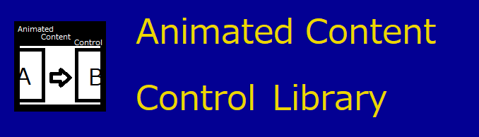

# 

  

## 概要

本ライブラリはContentプロパティ変更時に自作したアニメーションや 組み込まれた標準のアニメーションを実行可能な WPFで使用可能なAnimatedContentControlコントロールを提供するライブラリである。

本ライブラリは二つのアセンブリから構成されている

|                            Nuget                             |           assembly names           |                           remarks                            |
| :----------------------------------------------------------: | :--------------------------------: | :----------------------------------------------------------: |
|  | AnimatedContentControlLib.AnimKeys | WPFに依存しないViewModelで使用可能な 組み込みアニメーション名の定数 を提供するアセンブリ |
|  |   AnimatedContentControlLib.Wpf    |        AnimatedContentControl本体を提供するアセンブリ        |

### どちらのアセンブリをインストールすれば良いのか?

ViewとViewModelを同一のプロジェクトで管理する場合AnimatedContentControlLib.Wpfのみの インストールでよい。 AnimatedContentControlLib.WpfはAnimatedContentControlLib.AnimKeysに依存しているので AnimatedContentControlLib.WpfのインストールのみでAnimatedContentControlLib.Coreも付いてくる。

しかし、ViewとViewModelが別プロジェクトの場合 View側のプロジェクトにAnimatedContentControlLib.Wpfをインストールし、 ViewModel側のプロジェクトにAnimatedContentControlLib.AnimKeysをインストールすれば良い。
